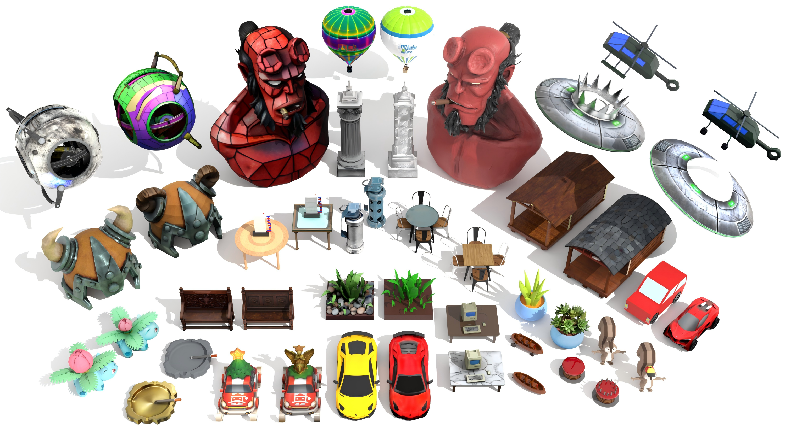
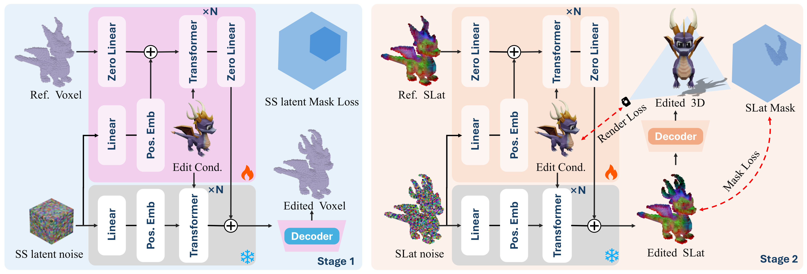
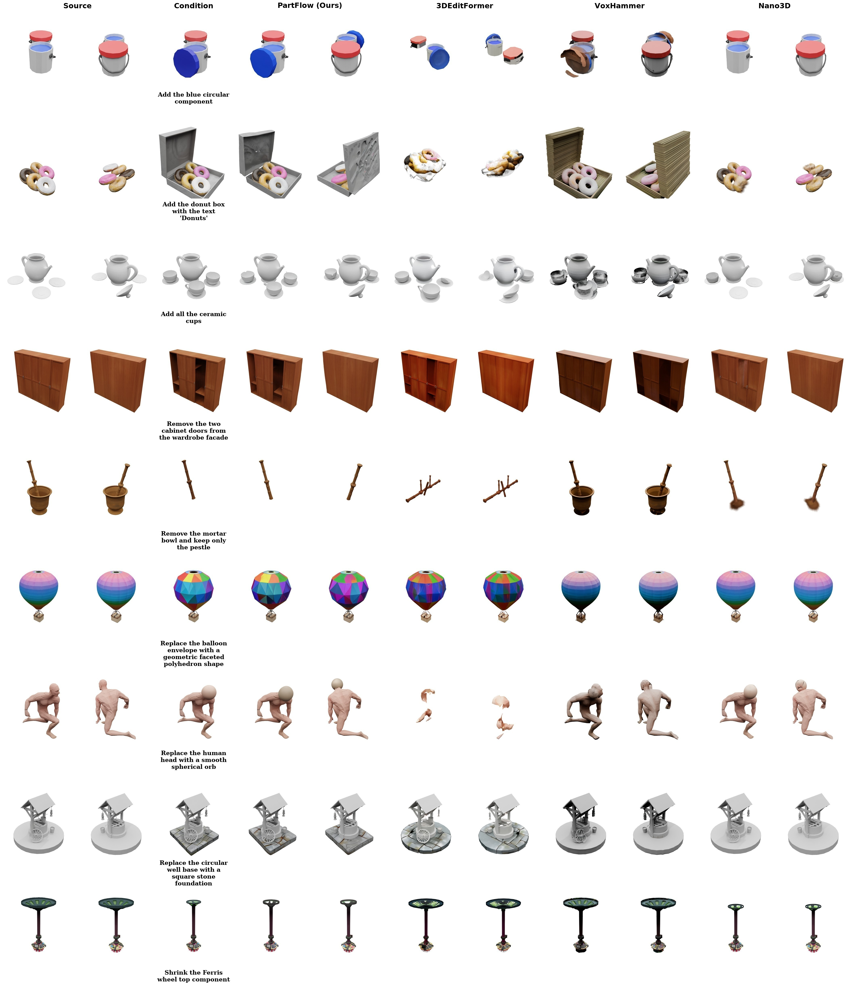
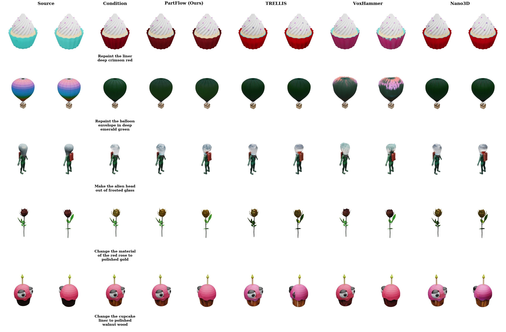

<div align="center">

# Feedforward 3D Editing Learns from Semantic-Part Transformation

[Jiawei Weng](mailto:jweng007@e.ntu.edu.sg)<sup>1,&ast;</sup>,
[Saining Zhang](https://sainingzhang.github.io/)<sup>1,&ast;,†</sup>,
[Zhenxin Diao](mailto:diaozhenxin2005@outlook.com)<sup>2,&ast;</sup>,
[Peishuo Li](mailto:peishuo001@e.ntu.edu.sg)<sup>1</sup>,
[Henghaofan Zhang](mailto:hhfzhang@outlook.com)<sup>2</sup>,
[Junhao Chen](https://yisuanwang.github.io/)<sup>2</sup>,
[Hao Zhao](https://sites.google.com/view/fromandto)<sup>2,†</sup>

<sup>1</sup>Nanyang Technological University, Singapore &nbsp;&nbsp;
<sup>2</sup>Tsinghua University, China

<sub>&ast;Equal contribution. †Corresponding author.</sub>

</div>

<div align="center">
  <a href="https://dennis-jwweng.github.io/pxform/"></a>
  <a href="#"></a>
  <a href="#"></a>
  <a href="https://huggingface.co/datasets/ART-3D/Pxform_v1"></a>
  <a href="https://huggingface.co/ART-3D/PartFlow_models"></a>
  <a href="LICENSE"></a>
</div>

<div align="center">
  
</div>

> **PartFlow** is a feedforward 3D editing network that edits an existing 3D
> asset to match a target edit image — no per-asset optimisation, no 3D mask
> at inference. We train it on **Pxform**, a high-quality 3D editing dataset
> with 100K+ consistent before/after pairs across seven edit types, grounding
> edits in semantic 3D parts.

## Highlights

- **Feedforward** — one forward pass per edit
- **Semantic-part grounded** — trained on Pxform's part-level pairs
- **Mask-free at inference** — only needs the source asset + a target image
- **Two-stage flow** — sparse-structure edit ➜ structured-latent edit


## Method

<div align="center">
  
</div>

PartFlow edits in two stages, conditioning a pretrained 3D generative prior
([TRELLIS](https://github.com/microsoft/TRELLIS)) on the **source asset's
latent** and a **target edit image**. Each stage is a controlled flow model
with a zero-linear gated reference branch and a mask-aware training loss:

- **Stage 1 — Sparse-structure flow.** Inputs the source SS latent + edit
  condition, predicts the edited 16³ voxel structure.
- **Stage 2 — Structured-latent (SLAT) flow.** Inputs the source SLAT mapped
  to the edited coords + edit condition, predicts the edited SLAT, which the
  TRELLIS decoders turn into a textured `edit.glb`.

## Installation

PartFlow reuses the TRELLIS runtime (same CUDA extensions, same frozen
DINOv2 / SS / SLAT decoders). Set up TRELLIS first, then add PartFlow on top.
Tested with **Python 3.10**, **PyTorch 2.5.0**, **CUDA 12.4**.

**1. Set up the TRELLIS environment.** Follow the official
[TRELLIS installation guide](https://github.com/microsoft/TRELLIS#-installation)
to create the conda env and build the CUDA extensions (`spconv`,
`flash-attn`, `kaolin`, `diff_gaussian_rasterization`, `nvdiffrast`,
`diffoctreerast`). For convenience, an equivalent one-liner is bundled here:

```bash
. ./setup.sh --new-env --basic --flash-attn --diffoctreerast --spconv \
             --mipgaussian --kaolin --nvdiffrast
```

**2. Install PartFlow's extra Python dependencies** into the same env:

```bash
pip install -r requirements.txt
```

## Weights

```bash
python download_weights.py          # -> ./weights/{stage1_ss,stage2_slat}/
```

Pulls the two trained stage models from
[`ART-3D/PartFlow_models`](https://huggingface.co/ART-3D/PartFlow_models).

## Data layout

Inference reads pre-encoded inputs. Each *case* is a directory:

```text
<case_dir>/
    ori_ss_latents.npz   # key `mean`: float32 [8, 16, 16, 16]   — source sparse-structure latent
    ori_latents.npz      # `coords` [N,3] int, `feats` [N,8] f32 — source structured latent (SLAT)
    edit_img.png         # the target edit image (RGB or RGBA)
    case_meta.json       # optional metadata (prompt, edit type, ...)
```

`ori_ss_latents.npz` / `ori_latents.npz` are the TRELLIS latents of the
**source** asset; produce them with the standard TRELLIS image-to-3D encoder.
Ground-truth `edit_*` files, if present, are ignored by inference.

## Run inference

```bash
# single case
python inference.py --input examples/mod_glass_disc_table --output_dir outputs

# a whole directory of cases
python inference.py --input /path/to/pxform/cases --output_dir outputs

# useful flags
#   --steps 50           flow-sampling steps
#   --cfg_strength 0.0   classifier-free guidance (0 = condition only)
#   --manifest ids.json  restrict to a list of case ids
#   --skip_existing      resume a partial run
```

Each case writes `outputs/<edit_id>/edit.glb` and `pred_slat.npz`.

## Repository layout

```text
PartFlow/
├── inference.py        two-stage inference pipeline + CLI
├── dataset.py          PxformDataset (per-case loader)
├── download_weights.py fetch weights from Hugging Face
├── configs/            Stage 1 / Stage 2 model configs
├── examples/           one ready-to-run example case
├── trellis/            TRELLIS backbone + PartFlow stage models
├── assets/             README figures
├── setup.sh            CUDA-extension installer
└── requirements.txt    pure-pip dependencies
```

## Results Comparison

<div align="center">
  
  <br/><br/>
  
</div>

## Citation

```bibtex
@article{pxform2026,
  title   = {Pxform: Feedforward 3D Editing Learns from Semantic-Part Transformation},
  author  = {Pxform Team},
  journal = {Preprint},
  year    = {2026}
}
```

## Acknowledgements

Built on [TRELLIS](https://github.com/microsoft/TRELLIS).
