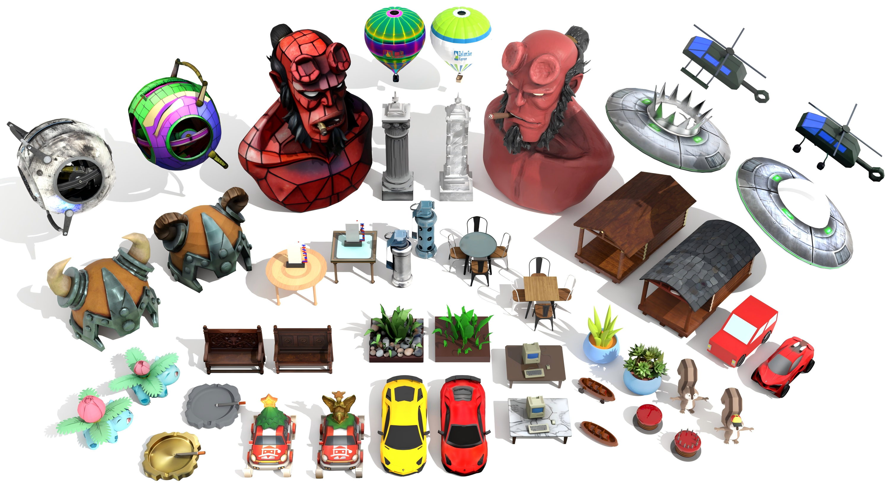
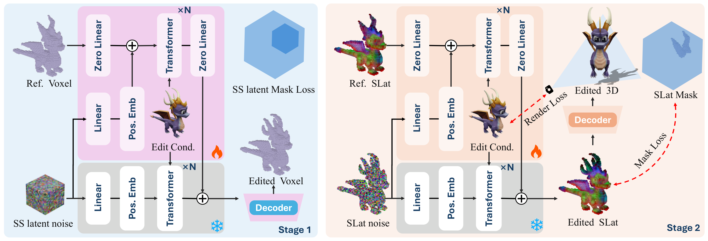
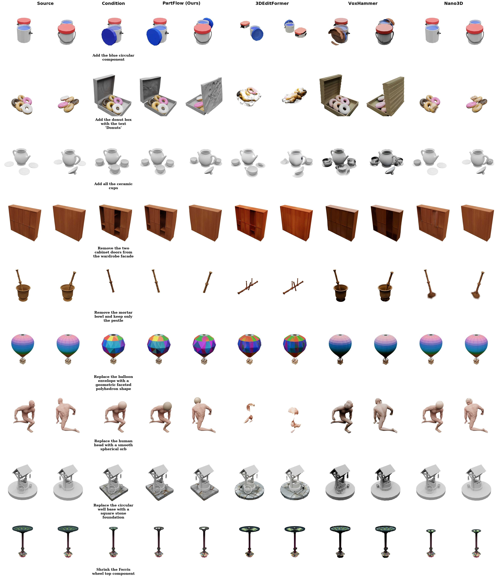
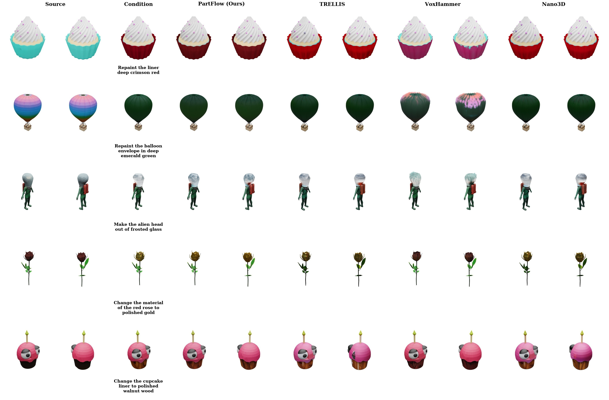

<div align="center">

# [SIGGRAPH ASIA 2026] Feedforward 3D Editing Learns from Semantic-Part Transformation

[Jiawei Weng](mailto:jweng007@e.ntu.edu.sg)<sup>1,&ast;</sup>,
[Saining Zhang](https://sainingzhang.github.io/)<sup>1,&ast;,†</sup>,
[Zhenxin Diao](mailto:diaozhenxin2005@outlook.com)<sup>2,&ast;</sup>,
[Peishuo Li](mailto:peishuo001@e.ntu.edu.sg)<sup>1</sup>,
[Henghaofan Zhang](mailto:hhfzhang@outlook.com)<sup>2</sup>,
[Junhao Chen](https://yisuanwang.github.io/)<sup>2</sup>,
[Hao Zhao](https://sites.google.com/view/fromandto)<sup>2,†</sup>

<sup>1</sup>Nanyang Technological University, Singapore &nbsp;&nbsp;
<sup>2</sup>Tsinghua University, China

<sub>&ast;Equal contribution. †Corresponding author.</sub>

</div>

<div align="center">
  <a href="https://dennis-jwweng.github.io/pxform/"></a>
  <a href="https://arxiv.org/abs/2605.27351"></a>
  <a href="https://huggingface.co/datasets/ART-3D/Pxform_v1"></a>
  <a href="https://huggingface.co/ART-3D/PartFlow_models"></a>
  <a href="LICENSE"></a>
</div>

<div align="center">
  
</div>

**PartFlow** edits an existing 3D asset to match a target image, with no per-asset
optimization or 3D mask at inference. It learns from **Pxform**: 100K+ paired edits
across seven edit types, grounded in semantic parts.

## 📰 News

- **October 2026:** SS and SLAT training code released with data preparation, mask losses, and render losses.
- **August 2026:** Paper accepted to **SIGGRAPH Asia 2026**.
- **May 2026:** Inference code and pretrained weights released.

## ✨ Highlights

- **Feedforward** — one forward pass per edit
- **Semantic-part grounded** — trained on Pxform's part-level pairs
- **Mask-free at inference** — only needs the source asset + a target image
- **Two-stage flow** — sparse-structure edit ➜ structured-latent edit

## 🔬 Method

<div align="center">
  
</div>

Both stages condition a pretrained [TRELLIS](https://github.com/microsoft/TRELLIS)
backbone on source latents and a target edit image, using a gated control branch.

- **Stage 1 — Sparse-structure flow:** predicts the edited SS latent.
- **Stage 2 — Structured-latent (SLAT) flow:** maps source features to edited
  coordinates and predicts the edited SLAT, decoded into a textured `edit.glb`.

## 🛠️ Installation

PartFlow uses the TRELLIS runtime. Tested with **Python 3.10**, **PyTorch 2.5.0**,
and **CUDA 12.4**.

**1. Set up TRELLIS.** Follow the [official installation guide](https://github.com/microsoft/TRELLIS#-installation)
or use the bundled installer:

```bash
. ./setup.sh --new-env --basic --flash-attn --diffoctreerast --spconv \
             --mipgaussian --kaolin --nvdiffrast
```

**2. Install PartFlow dependencies** in the same environment:

```bash
pip install -r requirements.txt
```

## 🤗 Weights

```bash
python download_weights.py          # -> ./weights/{stage1_ss,stage2_slat}/
```

Pulls the two trained stage models from
[`ART-3D/PartFlow_models`](https://huggingface.co/ART-3D/PartFlow_models).

## 📁 Data layout

Inference reads pre-encoded inputs. Each *case* is a directory:

```text
<case_dir>/
    ori_ss_latents.npz   # key `mean`: float32 [8, 16, 16, 16]   — source sparse-structure latent
    ori_latents.npz      # `coords` [N,3] int, `feats` [N,8] f32 — source structured latent (SLAT)
    edit_img.png         # the target edit image (RGB or RGBA)
    case_meta.json       # optional metadata (prompt, edit type, ...)
```

Encode the **source** asset with TRELLIS. Provide SLAT features as **raw encoder
outputs**; inference handles normalization and decoder denormalization.
Ground-truth edited latents are optional and ignored by inference.

## 🚀 Run inference

```bash
# single case
python inference.py --input examples/mod_glass_disc_table --output_dir outputs

# a whole directory of cases
python inference.py --input /path/to/pxform/cases --output_dir outputs

# resume with --skip_existing; restrict cases with --manifest ids.json
# sampling options: --steps 50 --cfg_strength 0.0
```

Each case writes `outputs/<edit_id>/edit.glb` and `pred_slat.npz`.

## 🏋️ Training

Two-stage training includes real part-mask loss, SS silhouette render loss and
SLAT RGB render loss.

The published [Pxform_v1 training data and masks](https://huggingface.co/datasets/ART-3D/Pxform_v1/tree/main/data)
are prepared together under `data/Pxform_v1/`:

```bash
pip install -r requirements-training.txt
python download_data.py --shards 00    # one shard to get started; use all for full data
GPU_ID=0 bash scripts/run_training_smoke.sh
python train.py --config configs/train_stage1_ss.json --output_dir outputs/train_ss --num_gpus 1
python train.py --config configs/train_stage2_slat.json --output_dir outputs/train_slat --num_gpus 1
```

Data and real masks are discovered automatically under `data/Pxform_v1/`.
See the [training guide](docs/training.md) for normalization, losses, offline
weights, multi-GPU training, and resume options.

## 🗂️ Repository layout

```text
PartFlow/
├── train.py            SS and SLAT training CLI
├── download_data.py    download, extract and verify Pxform pairs + masks
├── data/               repository-local dataset location (large files ignored)
├── docs/training.md    training and data instructions
├── scripts/            training smoke entry
├── inference.py        two-stage inference pipeline + CLI
├── dataset.py          PxformDataset (per-case loader)
├── download_weights.py fetch weights from Hugging Face
├── configs/            Stage 1 / Stage 2 model configs
├── examples/           one ready-to-run example case
├── trellis/            TRELLIS backbone + PartFlow stage models
├── assets/             README figures
├── setup.sh            CUDA-extension installer
└── requirements.txt    pure-pip dependencies
```

## 🎨 Results Comparison

<div align="center">
  
  <br/><br/>
  
</div>

## 📖 Citation

```bibtex
@article{weng2026partflow,
  title   = {Feedforward 3D Editing Learns from Semantic-Part Transformation},
  author  = {Weng, Jiawei and Zhang, Saining and Diao, Zhenxin and Li, Peishuo and Zhang, Henghaofan and Chen, Junhao and Zhao, Hao},
  journal = {arXiv preprint arXiv:2605.27351},
  year    = {2026}
}
```

## 🙏 Acknowledgements

Built on [TRELLIS](https://github.com/microsoft/TRELLIS).
